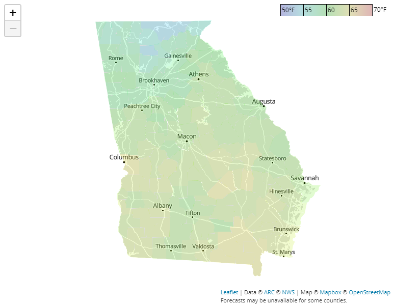

# georgia.forecast
Behold: my official forecast for the upcoming Georgia runoff elections! Forecasts of the weather, of course. What were you expecting?

**georgia.forecast** is a tool that gathers and maps National Weather Service forecasts for Tuesday, January 5th, 2021, the day on which the state of Georgia is scheduled to hold two runoff elections for its U.S. Senate seats

## How to use
Just boot [the website](https://r-e-stern.github.io/georgia.forecast) up and explore the live data. Due to the number of GET requests involved in rendering the map, it's possible that data from some counties will be unavailable.

## Sample output
These forecasts were generated at noon Pacific time on December 31, 2020:

## How it works
This tool was written using JavaScript, jQuery, Leaflet.js, and custom Mapbox tiles of Georgia. It uses a shapefile from the [Atlanta Regional Commission](https://arc-garc.opendata.arcgis.com/datasets/dc20713282734a73abe990995de40497_68) and forecast data from the [National Weather Service](https://www.weather.gov).